# 🔐 Understanding the Magic: How Login Works in Our Framework

Welcome! If you're new to Playwright and this framework, you might be wondering: **"Where is the login code in `cart.spec.js`?"**

You look at the test, and it just starts adding items to the cart. But how did we get logged in? 🤔

This guide explains the "Magic" behind the scenes.

---

## 🎩 The Secret: Custom Fixtures

In standard coding, you might write:
1. Open Browser
2. Go to Login Page
3. Type Username
4. Type Password
5. Click Login
6. **Then do the actual test...**

In our framework, we use something called **Fixtures**. Think of a Fixture as a **"Pre-test Setup Robot"**.

When you write:
```javascript
test('should add product...', async ({ authenticatedPage }) => { ...
```

You are telling Playwright: **"Hey, before you run this test, please give me an `authenticatedPage`."**

Playwright sees this and asks the **Fixture Robot** to build it for you.

---

## 🔄 The Data Flow: Step-by-Step

Here is exactly what happens in the background before your test even starts line 1:

```mermaid
sequenceDiagram
    participant Test as 🧪 cart.spec.js
    participant Fixture as 🤖 authFixture.js
    participant Excel as 📊 excelReader.js
    participant Page as 🌐 LoginPage.js
    
    Test->>Fixture: Requests { authenticatedPage }
    Note over Fixture: 🛑 Test waits here...
    
    Fixture->>Excel: getLoginCredentials(0)
    Excel-->>Fixture: Returns "standard_user" & password
    
    Fixture->>Page: navigateToLoginPage()
    Fixture->>Page: doLogin("standard_user", "...")
    
    Note over Page: 🖱️ Types username<br/>🖱️ Types password<br/>🖱️ Clicks Login
    
    Page-->>Fixture: Login Complete
    
    Fixture-->>Test: ✅ Here is your logged-in page!
    Note over Test: ▶️ Test starts running now
```



---

## 📝 Code Breakdown

### 1. The Test (`cart.spec.js`)
Notice we don't write any login code here! We just ask for `authenticatedPage`.

```javascript
// We ask for 'authenticatedPage' inside the curly braces {}
test('should add product to cart', async ({ authenticatedPage }) => {
    
    // By the time this line runs, we are ALREADY logged in!
    const { dashboardPage } = authenticatedPage;
    
    await dashboardPage.addProductToCartByName(...);
});
```

### 2. The Fixture (`fixtures/authFixture.js`)
This is where the work happens. It's defined once, so we don't repeat code.

```javascript
authenticatedPage: async ({ page, loginPage }, use) => {
    // 1. Get data from Excel (Row 0 = standard_user)
    const credentials = excelReader.getLoginCredentials(0);
    
    // 2. Go to login page
    await loginPage.navigateToLoginPage();
    
    // 3. Perform the login action
    await loginPage.doLogin(credentials.username, credentials.password);
    
    // 4. Pass the ready-to-use page to the test
    await use({ loginPage, dashboardPage, cartPage, page });
}
```

### 3. The Excel Reader (`utils/excelReader.js`)
We keep our users in Excel so we can change them easily without touching code.

```javascript
getLoginCredentials(index = 0) {
    // Reads row 0 from testData.xlsx
    // Returns: { username: 'standard_user', ... }
}
```

---

## 🆚 "login" vs "authenticatedPage": What's the difference?

You might see two different fixtures in our code. Here is when to use which:

### 1. `authenticatedPage` (The "Auto-Pilot")
*   **What it does:** Logs you in **automatically** before the test starts.
*   **When to use:** When you want to test features **inside** the app (like Cart, Checkout, Inventory). You don't care *how* you got logged in, you just want to be there.
*   **Example:** `test('add to cart', async ({ authenticatedPage }) => { ... })`

### 2. `login` (The "Manual Control")
*   **What it does:** Gives you a helper function to login **when you want**.
*   **When to use:** When you need to test the **login process itself** (e.g., login with different users, check error messages).
*   **Example:**
    ```javascript
    test('login with locked user', async ({ login }) => {
        await login(1); // Manually trigger login for user at index 1
    });
    ```

---

## 🚀 Why Do We Do This?

1.  **Simplicity**: Your tests focus on **Shopping Cart** logic, not Login logic.
2.  **Reusability**: We write the login code **once** in the fixture, and use it in 100 tests.
3.  **Maintenance**: If the Login Page changes (e.g., new field), we fix it in **one place** (`LoginPage.js`), and all tests are fixed.
4.  **Data Driven**: If we want to test with a different user, we just change the Excel file.

---

## 🧠 Summary for New QAs

*   **Don't look for `await page.click('#login')` in the test file.** It's hidden in the fixture.
*   **`authenticatedPage`** = "Log me in automatically, then start the test."
*   **`testData.xlsx`** = Where the username comes from.

Happy Testing! 🕵️‍♀️
